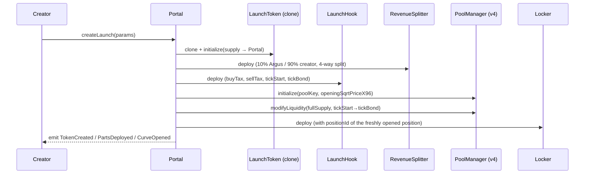
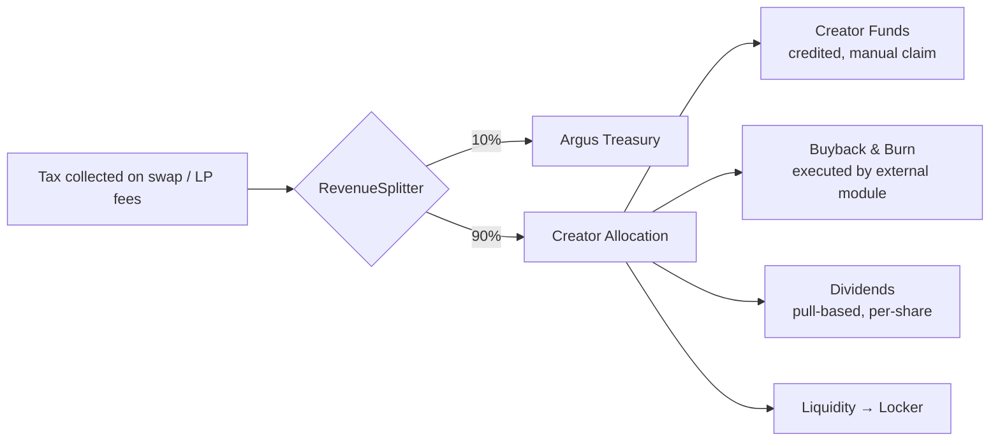

<div align="center">

<h1>ARGUS</h1>


<a href="https://argus.world">
  
</a>

</div>

[](#license)
[](#repository-layout)
[-1a2740?style=for-the-badge)](#network-specifications)
[](https://argus.world)
[](https://x.com/arguspad)

</div>


**Argus** is the native, permissionless token launchpad for **Arc**, Circle's Layer 1 blockchain optimized for stablecoin finance. Every token launched through Argus automatically opens a Uniswap v4 pool with a dedicated tax hook, and all collected fees are redistributed natively in USDC.

There is no virtual bonding curve: the entire token supply is deposited into a single v4 liquidity position, above the opening price. Buys walk the price up through that position.

## Table of Contents
- [Network Specifications](#network-specifications)
- [Protocol Evolution](#protocol-evolution)
- [How a Launch Works](#how-a-launch-works)
- [Contract Architecture](#contract-architecture)
  - [Portal](#1-portalsol--the-factory)
  - [LaunchToken](#2-launchtokensol--the-eip-1167-token)
  - [LaunchHook](#3-launchhooksol--tax--bonding)
  - [RevenueSplitter](#4-revenuesplittersol--revenue-distribution)
  - [Locker](#5-lockersol--locked-liquidity)
- [Tax Mechanics](#tax-mechanics)
- [Revenue Distribution](#revenue-distribution)
- [Token Standards (EIP-1167)](#token-standards-eip-1167)
- [Repository Layout](#repository-layout)
- [Implementation Status & Known Limitations](#implementation-status--known-limitations)
- [Security](#security)
- [License](#license)

## Network Specifications

Argus is deployed on Arc Mainnet, using native USDC for gas and protocol operations.

| Parameter | Value |
| --- | --- |
| **Network** | Arc Mainnet |
| **Chain ID** | `5042` (`0x13b2`) |
| **Native Asset** | USDC |
| **DEX Engine** | Uniswap v4 |
| **Current Portal (v7)** | `0xB021Be536808f551b31789422Fd28a6c9c6e97Da` |
| **PoolManager** | `0x8366a39CC670B4001A1121B8F6A443A643e40951` |
| **Standard Fee Tier** | 1% (10000 bps) |
| **Tick Spacing** | 200 |
| **Supply per Launch** | 1,000,000,000 tokens (18 decimals) |

## Protocol Evolution

Argus has transitioned from a legacy Uniswap v3 model to a modular Uniswap v4 architecture:

| Feature | **Legacy Portals** (#1–#2) | **Hooked Portals** (#3–#7) |
| --- | --- | --- |
| **Liquidity Venue** | Uniswap v3 | Uniswap v4 (Dedicated Hooks) |
| **Tax Logic** | Internal to Token | Managed by Hook (Swap-based) |
| **Quote Asset** | Fixed | Configurable (v6+) |
| **Payout Model** | Standard Push | Credit-based `claim()` |

## How a Launch Works

Each call to `Portal.createLaunch(...)` executes the entire sequence below in a single transaction:



1. **Token clone** — `LaunchToken` is cloned via EIP-1167 and the entire supply (1B) is minted to the Portal itself.
2. **Splitter & Hook deployment** — the Splitter is created first (it will manage revenue), then the Hook (which references the Splitter as an immutable address).
3. **v4 pool initialization** — the Portal calls `initialize()` on the `PoolManager` with the hook attached to the `token/quoteAsset` pair.
4. **Position opening** — the entire supply is deposited into a single concentrated liquidity position, between `tickStart` and `tickBond`, above the opening price. There's no virtual bonding curve: it's real on-chain liquidity from the very first block.
5. **Locker deployment** — once the `positionId` is known, the `Locker` is created, becoming the permanent beneficiary of the LP fees.
6. **Registration & events** — the launch is saved in `launches(token)` and `TokenCreated`, `PartsDeployed`, `CurveOpened` are emitted with the exact documented signatures (for compatibility with existing indexers).

## Contract Architecture

### 1. `Portal.sol` — The Factory

The protocol's permissionless entry point. Anyone can launch a token by calling `createLaunch()`.

- Validates that the 4 allocation percentages (`creatorFundsBps`, `buybackBurnBps`, `dividendsBps`, `liquidityBps`) sum to exactly 10,000 bps (100%).
- Validates that buy/sell taxes are between 1% and 10% per side, and not both zero (the check is repeated in the Hook, to fail early and save gas).
- Maintains a public registry `launches(address token) → LaunchRecord` and an `allTokens` array for on-chain discovery, plus `getTokens(offset, limit)` for pagination.
- Exposes `LAUNCH_STRUCT_WORDS()` (= 11), useful for integrators decoding the record's storage layout.

### 2. `LaunchToken.sol` — The EIP-1167 Token

A minimal ERC-20 designed to be cloned, not to hold business logic.

- **No transfer tax**: a wallet-to-wallet transfer costs nothing. All taxation happens exclusively on swaps, at the Hook level.
- **No administrative privileges**: the `factory` (the Portal) has no mint, pause, or blacklist power over the token after deployment.
- **Fixed supply at initial mint**: `initialize()` can only be called once (guarded by `_initialized`), minting the entire supply to the Portal.

### 3. `LaunchHook.sol` — Tax & Bonding

The core trading logic. It hooks into the v4 pool via the `beforeSwap` / `afterSwap` callbacks.

- **Taxes fixed for the hook's lifetime**: `buyTaxBps` and `sellTaxBps` are immutable, set by the Portal at deploy time and never changeable afterward — consistent with "rules don't change after launch."
- **Opening snipe tax**: an additional surcharge (up to 99% combined) that decays within the first 3 seconds after launch, following a non-linear (right-shift) decay curve. It's meant to discourage bots trying to buy in the launch block. Portal and Splitter are exempt (to allow the creator's dev buy).
- **Monotonic bonding latch**: once the price crosses `tickBond`, the `bonded` state locks to `true` forever — even if the price later retraces below that threshold.
- **Combined rate cap**: launch tax + snipe tax can never exceed 99% (`COMBINED_RATE_CAP_BPS`).

### 4. `RevenueSplitter.sol` — Revenue Distribution

Receives every taxed USDC (from swaps via the Hook, and from LP fees via the Locker) and routes it according to a fixed 10% / 90% split.

- **10% to Argus**, transferred immediately to the protocol treasury.
- **90% to the creator**, split into 4 configurable destinations set at launch time:
  - **Creator funds** → credited internally, withdrawable only by the creator via `claim(to, quoteAsset)`.
  - **Buyback & burn** → tracked via an event (`BuybackBurnAllocated`); the actual swap+burn execution is delegated to an external permissionless module.
  - **Dividends** → distributed to holders through a pull-based, per-share accumulator (a "scaled balance" pattern similar to a masterchef), not a push on every transfer.
  - **Liquidity** → sent directly to the launch's `Locker`.
- **"Credited is not paid"**: creator funds and dividends remain as an internal balance until the corresponding claim function is explicitly called.

### 5. `Locker.sol` — Locked Liquidity

A non-custodial contract that permanently holds the v4 liquidity position.

- **No withdrawal function**: there's no `withdraw`, `rescue`, or any admin function — by construction, not by convention. The Argus team can never reclaim locked liquidity.
- **`harvestFees()` is permissionless**: anyone can call it to collect the position's accrued LP fees and route them to the `RevenueSplitter`, where they're split using the same 10%/90% logic used for swap taxes.

## Tax Mechanics

Every swap on the pool can pay up to three components, summed and applied on the quote-asset leg:

| Component | Range | Notes |
| --- | --- | --- |
| Pool fee (v4) | Fixed 1% | Standard fee tier for the Argus family |
| Launch tax (buy/sell) | 1%–10% per side | Fixed forever at Hook deployment |
| Opening snipe tax | Up to 99% combined, decays in 3s | Exempt for Portal and Splitter |

The combined cap (launch tax + snipe tax) is always limited to 99% (`COMBINED_RATE_CAP_BPS = 9900`).

## Revenue Distribution



## Token Standards (EIP-1167)

To ensure maximum gas efficiency and security, Argus utilizes the **EIP-1167 Minimal Proxy** standard:

- **Implementation**: every launched token is a clone of the verified master implementation (`LaunchToken`).
- **Logic separation**: the token contract stays deliberately lightweight — taxes, bonding curve, and liquidity locking are handled externally by the Uniswap v4 Hook, not by the token itself.

## Repository Layout

```text
.
├── contracts/               # Core Solidity protocol implementation
│   ├── interfaces/          # Internal interfaces (IERC20Minimal, IPoolManagerMinimal, ...)
│   ├── libraries/           # Utilities (Clones, ...)
│   └── *.sol                # Core contracts: Portal, LaunchToken, LaunchHook,
│                             #   RevenueSplitter, Locker
├── docs/                    # Technical documentation and guides
├── onchain/                 # Official contract addresses and event signatures
└── scripts/                 # Deployment and interaction utilities
```

## Implementation Status & Known Limitations

This is a **reference implementation**, meant to faithfully document the protocol's intended behavior. A few points are deliberately simplified compared to a production deployment, and are explicitly flagged in the code:

- **Placeholder `positionId`** — in `Portal.createLaunch()`, the `positionId` is derived from the `poolId` instead of coming from a real `PositionManager` (NFT), because this reference uses raw `modifyLiquidity` on the `PoolManager` directly instead of the peripheral contract.
- **Simplified buy/sell direction** — `LaunchHook` assumes `params.zeroForOne` already correctly maps to buy/sell; in production it must be derived from `tokenIsToken0` (present in the `LaunchRecord`), not assumed.
- **Bonding latch update not yet wired** — `afterSwap` doesn't yet read the post-swap tick from the `PoolManager` to trigger `_bonded`; it's left as an explicit TODO in the code.
- **Splitter↔Locker circular dependency** — `RevenueSplitter` is deployed with `liquidityLocker = address(0)` because the real `Locker` requires a `positionId` that's only known after the position is opened. This should be solved with a two-phase pattern (deploy + `initialize()`), as already done for `LaunchToken`.
- **Dev buy not implemented** — the Portal's exemption from the snipe tax is already wired into the Hook, but the actual `swap()` call for the optional dev buy is left as a TODO in `Portal.createLaunch()`.
- **Direct fee transfers** — in a real deployment, v4 balances stay inside the `PoolManager` until `take()`/`settle()`; here simplified to direct transfers for readability.

None of this invalidates the design described in the documentation, but **these points must be resolved before a production deployment**.

## Security

- **Transparency**: all core logic is verifiable on-chain via the Arc Explorer.
- **Auditability**: modular architecture separating token balances from trading logic.
- **Non-Custodial**: the Argus team has no administrative access to individual token liquidity once it's locked in the `Locker`.

## License

The Argus Protocol source code is licensed under the **MIT License**.

<div align="center">

</div>
